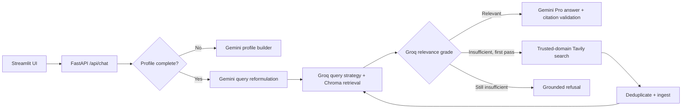

# PolicyPilot


PolicyPilot is a full-stack, source-grounded U.S. health insurance advisor. It combines a Streamlit chat interface, FastAPI, LangGraph, ChromaDB, Gemini, and Groq to answer personalized coverage and eligibility questions using approved government sources.

> PolicyPilot provides informational guidance, not an official eligibility or coverage determination. Users should confirm decisions with the relevant government program, Marketplace, employer, or insurer.

## What it demonstrates

- A bounded agentic-RAG graph with query reformulation, multi-strategy retrieval, relevance grading, one web-search fallback, re-retrieval, and grounded refusal.
- Explicit model responsibilities: Groq/Llama handles retrieval-oriented classification, transformation, grading, and summarization; Gemini handles profile conversation, reformulation, search-query generation, and final synthesis.
- Persistent ChromaDB retrieval with `sentence-transformers/all-MiniLM-L6-v2` embeddings and SQLite LangGraph checkpoints.
- Trusted-source enforcement for HealthCare.gov, CMS.gov, Medicaid.gov, Medicare.gov, VA.gov, and TRICARE.
- Deterministic, content-hash-based ingestion that skips unchanged chunks and replaces changed versions.
- Citation validation that permits only URLs present in the retrieved document metadata.
- A Streamlit frontend, typed FastAPI responses, Docker Compose, automated tests, and a small RAG evaluation set.

## Architecture



The web fallback is deliberately bounded to one attempt per user turn. After ingestion, PolicyPilot retrieves again so the final answer uses newly added evidence rather than stale context.

## Local setup

Requirements: Python 3.11, Google AI, Groq, and Tavily API keys. Chrome is required only for Selenium crawler jobs.

```bash
python3.11 -m venv .venv
source .venv/bin/activate
pip install -r requirements.txt
pip install -r requirements-frontend.txt
cp .env.example .env
```

Fill in the three API keys in `.env`. Then acquire and ingest the knowledge base explicitly:

```bash
python -m scripts.run_crawler
python -m scripts.run_ingestion
```

Start the backend and frontend in separate terminals:

```bash
uvicorn policypilot.main:app --reload --host 0.0.0.0 --port 8000
streamlit run frontend/app.py
```

Open `http://localhost:8501`. API documentation is available at `http://localhost:8000/docs`.

## Docker

```bash
cp .env.example .env
# Add real provider keys to .env.
docker compose --profile tools run --rm crawler
docker compose --profile tools run --rm ingester
docker compose up --build
```

The application is available at `http://localhost:8501`. SQLite, checkpoints, downloaded documents, and Chroma data persist in the `policypilot_data` volume. Crawling and ingestion never run automatically during application startup.

## Free hosted demo

The repository includes a Render Blueprint for the FastAPI backend and a Streamlit Community Cloud dependency file for the frontend.

1. In Render, create a Blueprint from this repository and provide `GOOGLE_API_KEY`, `GROQ_API_KEY`, and `TAVILY_API_KEY` when prompted.
2. After the backend is healthy, note its public URL, such as `https://policypilot-api.onrender.com`.
3. In Streamlit Community Cloud, deploy `frontend/app.py` from this repository.
4. In the Streamlit app settings, add `POLICYPILOT_BACKEND_URL = "https://policypilot-api.onrender.com/api"` to the secrets configuration.

Render's free service filesystem is ephemeral, so its local SQLite and Chroma data can be lost when the service is restarted or redeployed. The bounded trusted-web fallback lets the demo acquire evidence on demand, but a durable hosted release should replace local storage with persistent managed services. Free services can also sleep while idle, making the first request slower.

## API

- `POST /api/chat` runs one profile or advisor turn. The response retains the original fields and adds `sources`, a list of `{name, url}` government references used by the latest answer.
- `GET /api/geodata/{zip_code}` resolves a U.S. ZIP code to city, county, and state.
- `GET /health` reports application, SQLite, and Chroma readiness.

Example questions:

- “How is eligibility for Marketplace premium tax credits generally determined?”
- “When can someone first enroll in Medicare?”
- “What factors affect Medicaid eligibility in my state?”
- “What are the general eligibility requirements for VA health care?”
- “Do Marketplace plans include prescription drug coverage?”

## Tests and evaluation

All external LLM, search, and ZIP calls are mocked in the automated suite:

```bash
pytest -q
pytest --cov=policypilot --cov=scripts
```

With the backend running and the government corpus ingested, run the fixed six-question evaluation set:

```bash
python -m scripts.run_evaluation
```

It reports retrieval-domain hit rate, trusted-source rate, citation validity, and supported-versus-unsupported refusal accuracy. The dataset is intentionally small and demonstrates the evaluation workflow; it is not a clinical, regulatory, or production benchmark.

## Data and source policy

Only HTTPS pages on the configured government allowlist can enter the dynamic knowledge base. Every stored chunk carries its canonical URL, source name, retrieval timestamp, content hash, and deterministic chunk ID. Existing prototype data under the former project name is not migrated; rebuild the PolicyPilot corpus using the crawler and ingestion commands above.

PolicyPilot processes location, income, citizenship, medication, and medical-history details in memory for personalization. It does not log complete request payloads. This portfolio release does not provide authentication, multi-user authorization, encrypted persistence, HIPAA certification, or a formal retention policy, so it should not be deployed for real sensitive health data without additional controls.

## Known limitations

- Source relevance is LLM-graded; it is not an official government eligibility decision.
- Government pages and program rules change, so the corpus must be refreshed and re-evaluated periodically.
- Plan-specific prices, formularies, provider networks, and private employer benefits require authoritative plan APIs or documents that are outside this allowlist.
- Citation validation confirms that URLs came from retrieved metadata; it does not prove that every natural-language inference is legally correct.

## Résumé description

> Developed PolicyPilot, a full-stack health insurance advisor using Streamlit, FastAPI, LangGraph, and ChromaDB, combining semantic retrieval with LLM reasoning for personalized coverage and eligibility questions.
>
> Integrated Gemini and Groq with trusted CMS.gov, VA.gov, HealthCare.gov, Medicare.gov, Medicaid.gov, and TRICARE sources, automating source retrieval, relevance verification, deduplicated ingestion, and citation-backed response generation.
